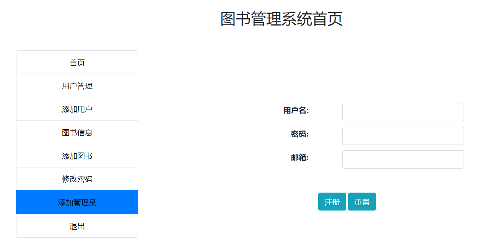
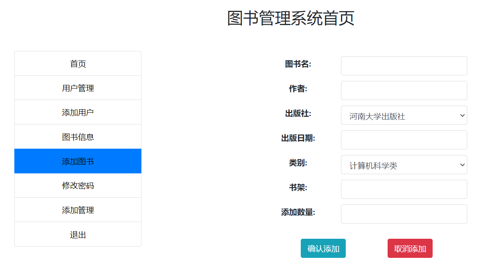
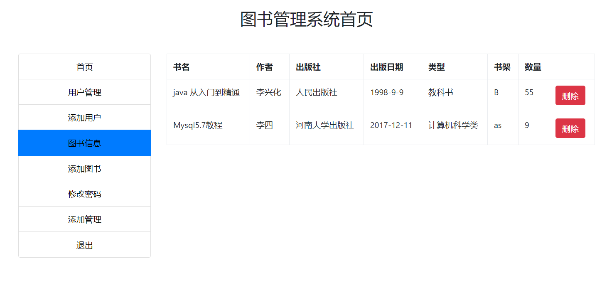
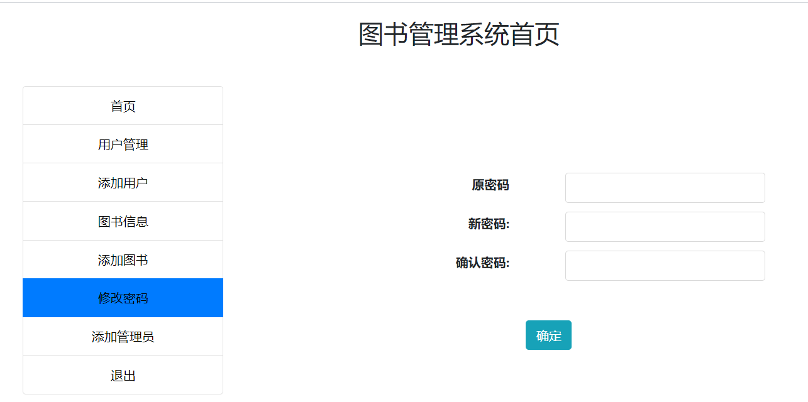
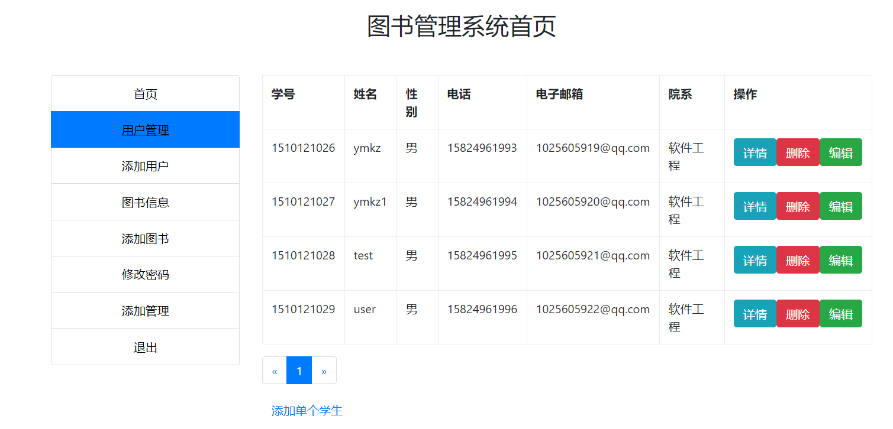

<h1 align="center">基于JSP+Servlet实现的图书管理系统</h1>

<h4> 完整代码获取地址：从戎源码网（https://armycodes.com/） </h4>
<h4> 作者微信：19941326836 QQ：605739993 QQ群：655392706 </h4>
<h4> 承接计算机毕设、Java毕业设计、Python毕业设计、深度学习、机器学习 </h4>
<h4> 选题+开题报告+任务书+程序定制+安装调试+论文+答辩ppt 一条龙服务 </h4>
<h4> 毕业设计所有选题地址：(https://github.com/Descartes007/allProject) </h4>

## 一、项目介绍

基于JSP+Servlet实现的图书管理系统：前端 JSP、BootStrap、JQuery、Ajax，后端 Servlet、JDBC，系统角色分为：管理员和用户。管理员在管理端对系统用户进行管理，可以发布图书信息等；用户可以对书籍进行借阅，归还等。主要功能如下：

### 1、管理员

- 基本操作：登录、修改密码、登出、添加管理员
- 用户管理：管理员可以查看用户列表、编辑用户信息、删除用户、查看用户信息详情、添加用户信息
- 图书管理：管理员可以添加、删除图书信息，包括图书封面、作者、出版社、ISBN号、简介等。

### 2、用户

- 基本操作：登录、修改密码、登出、注册
- 图书模块：借书、获取借阅列表、还书

## 二、环境

- <b>IntelliJ IDEA 2020.3</b>

- <b>Mysql 5.7.26</b>

- <b>Tomcat 9.0.41</b>

- <b>JDK 1.8</b>

## 三、运行截图

