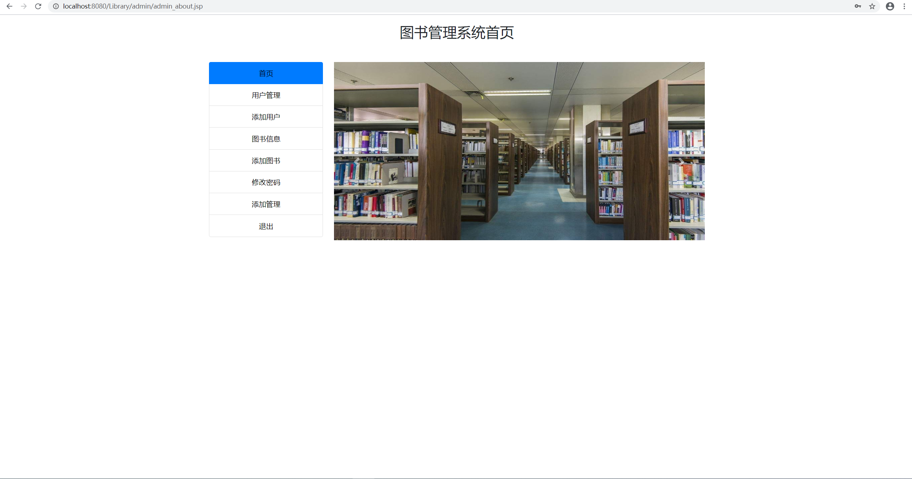
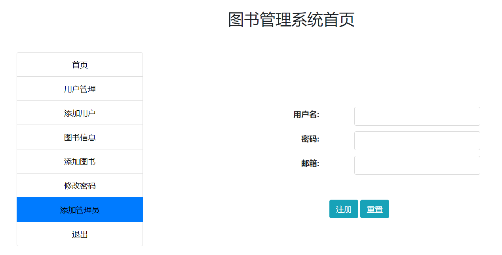
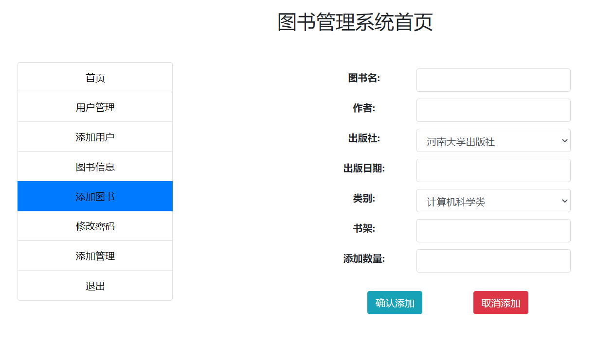
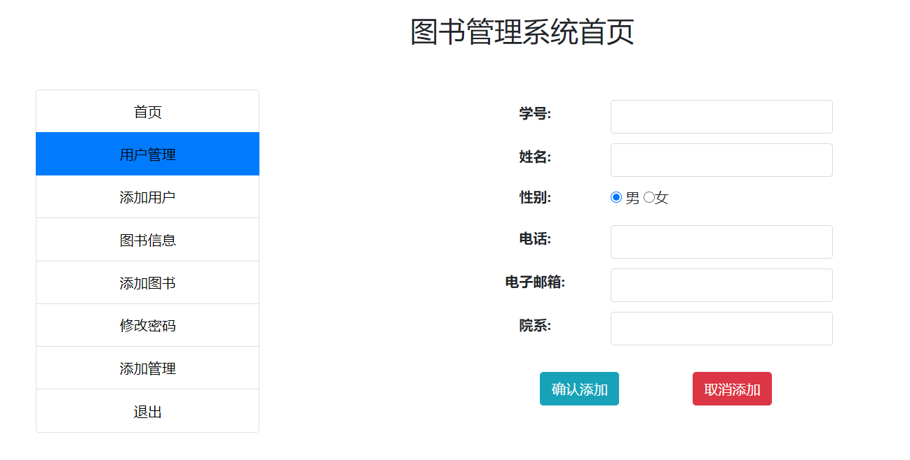
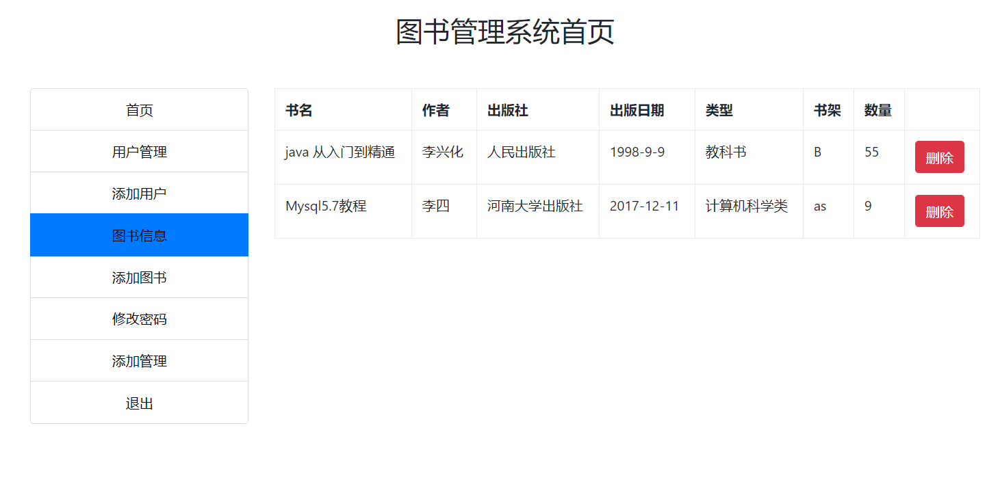
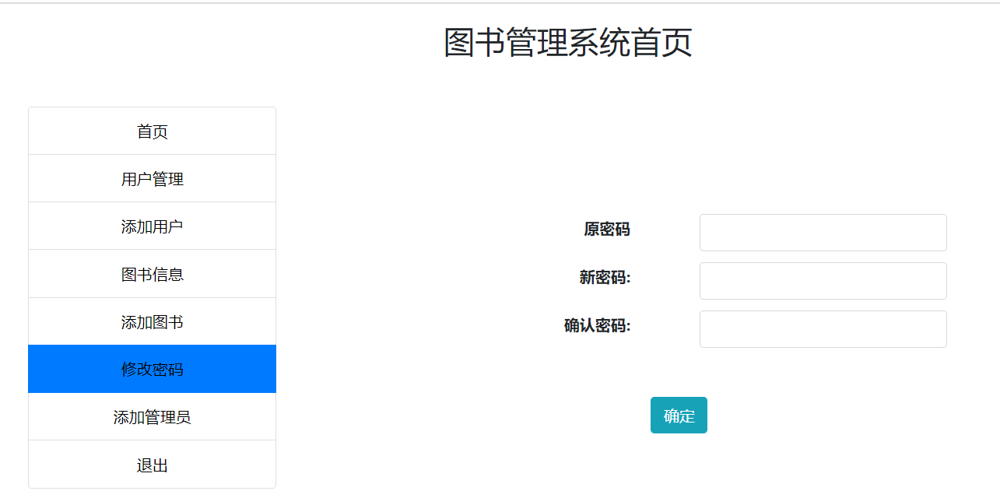
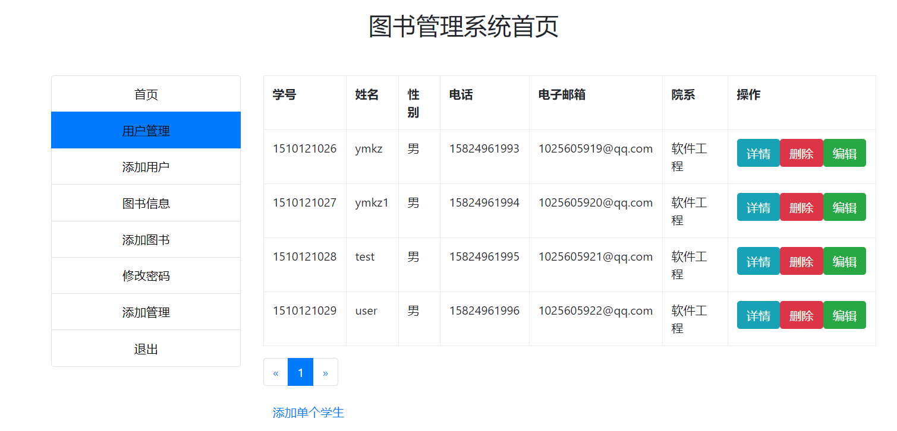

<h1 align="center">基于JSP+Servlet实现的图书管理系统</h1>

 获取sql文件 QQ: 605739993 QQ群: 377586148 

<b> 需要视频演示可联系上述QQ，私发视频链接 </b>

 [个人站点: 从戎源码网](https://armycodes.com/)

## 简介

> 本代码来源于网络,仅供学习参考使用!
>
> 提供1.远程部署/2.修改代码/3.设计文档指导/4.框架代码讲解等服务
>
> 管理员: admin 密码: admin
>

## 项目介绍

基于JSP+Servlet实现的图书管理系统，主要功能如下

**【管理员】功能：**

用户管理：管理员可以查看用户列表，编辑用户信息，删除用户等操作。
图书管理：管理员可以添加、编辑、删除图书信息，包括图书封面、作者、出版社、ISBN号、简介等。
借阅记录管理：管理员可以查看借阅记录，处理借阅请求，审核归还和续借请求等操作。
系统设置：管理员可以进行系统配置，如设置借阅期限、图书上架下架等。

**【普通用户】功能：**

用户注册和登录：普通用户可以注册新账号并登录系统。
图书查询：用户可以根据图书名称、作者、分类等条件进行图书的搜索和查询。
图书详情：用户可以查看图书的详细信息，包括图书封面、作者、出版社、ISBN号、简介等。
图书借阅：普通用户可以借阅图书，需要提供借阅日期和归还日期。
图书归还：普通用户可以归还借阅的图书。
图书续借：普通用户可以续借借阅的图书。

### 技术栈
编程语言：Java
数据库：MySQL
前端技术：JSP、JavaScript、bootstrap、JQuery
后端技术：Servlet、JDBC

## 环境

- <b>IntelliJ IDEA 2020.3</b>

- <b>Mysql 5.7.26</b>

- <b>Tomcat 8.0.32</b>

- <b>JDK 1.8</b>

## 运行截图

